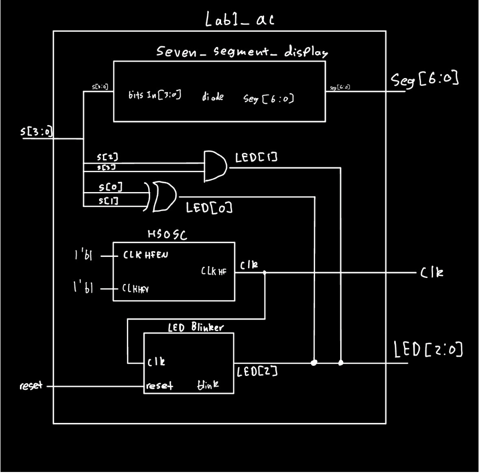
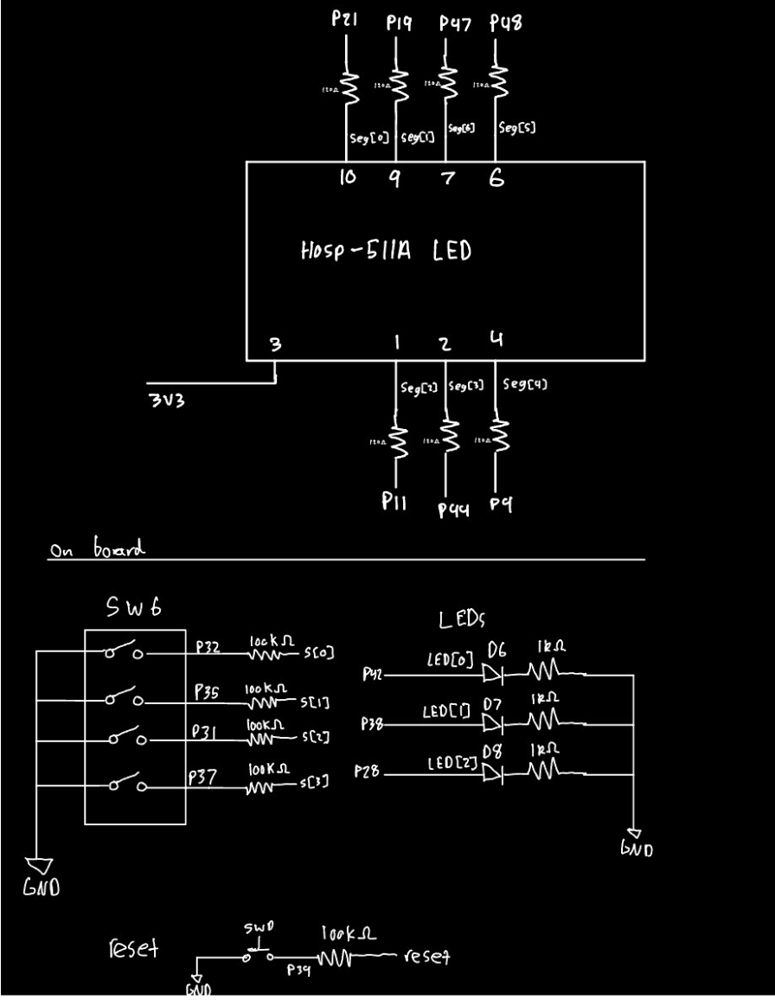
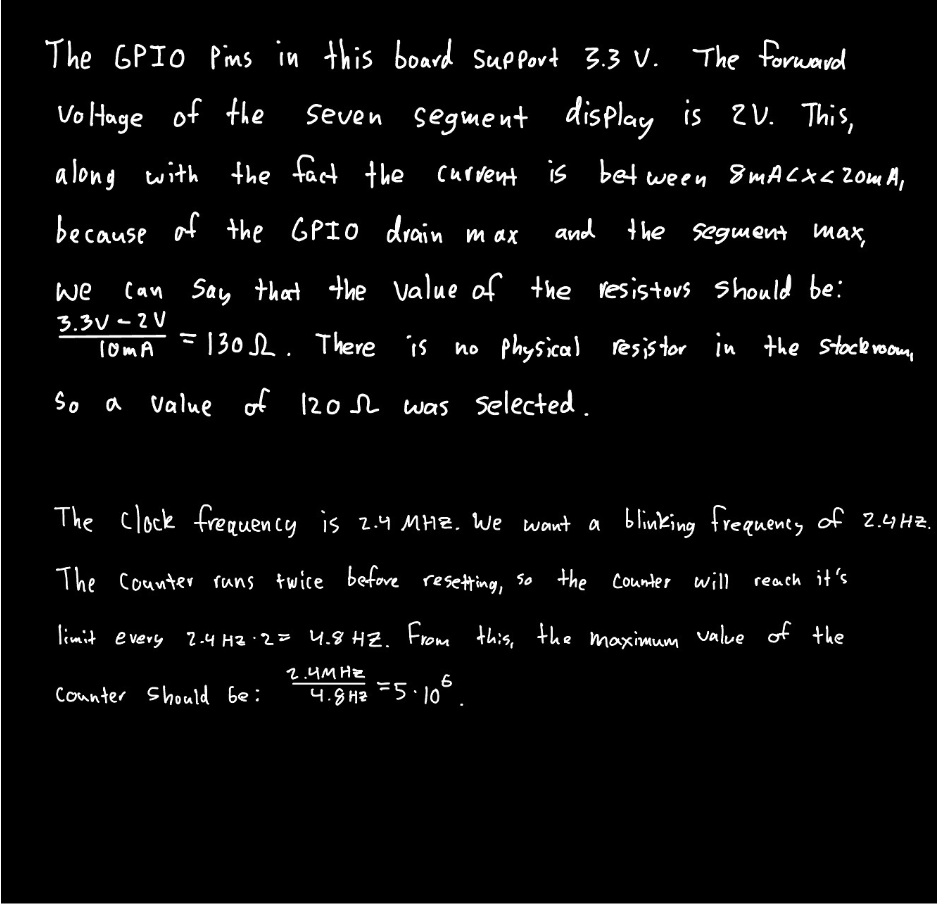
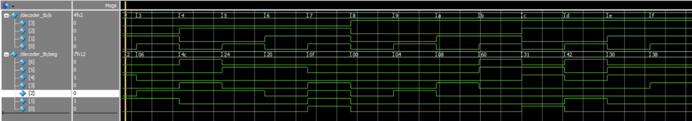
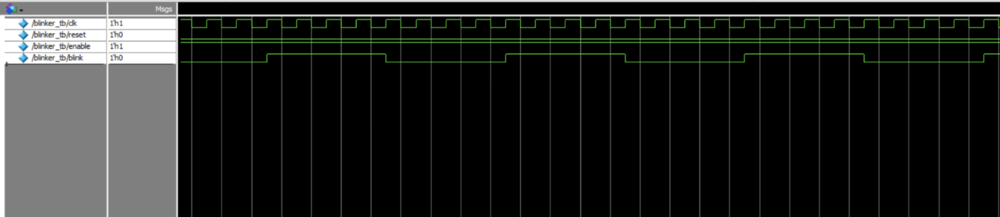
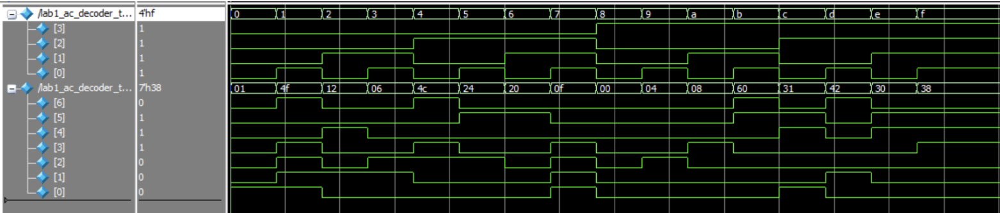
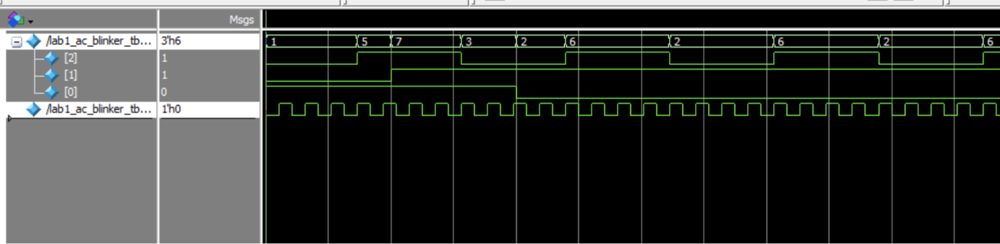

## Introduction

In lab 1, we were tasked with assembling the microP's board, and demonstrate that the onboard oscillator, 4 bit switch, and LEDs function, in conjunction with an external seven segment display. The HSOSC from Lattice ICE40 Ultra Plus that was configured to generate a 48MHz clock was parted down to produce a blinking LED signal of 2.4Hz. Combinational logic of XOR and AND was subsequently implemented to test the LED switch inputs. 

## Design and Testing Methodology

First, the microP's development board was soldered together, and verified through the use of a tutorial. The power rails were verified, and test code for the FPGA and MCU validated that it was functional. For the FPGA System Verilog code, the process includes an internal oscillator, a clock divider, a seven segment display, and LED control logic. This system was subsequently verified through the use of a testbench in Questa waveform simulations. After this verification, the system was tested on the hardware in order to check if the proper LED and seven segment display outputs appeared with the appropriate switch input. 
## Technical Documentation

The source of this lab can be found at

## Block Diagram
[Fig1. Block diagram of the system]


## Schematic
[Fig2. Component schematics]



[Fig 3. Resistor and CLK calculations]



## Results and Discussion

### Testbench Simulation
[Fig. 4 Decoder simulation waveforms]



[Fig. 5: blinker simulation wave forms]



[Fig. 6: top level decoder simulation wave forms]



[Fig. 7: top level blinker simulation wave forms]



The design met all of the intended objectives. The figures above display the Questa Waveform simulation. In order to achieve more precision in the future, a more sophisticated counter would be needed. 


## Conclusion

The design met all of the requirements and it successfully display the correct hexadecimal digits. The LED logic is correct and functional as well, and all of the hardware has been verified. In total, this lab took approximately 16 hours to complete. The most tedious part was creating the testbenches and debugging Quarto. 

## AI Prototype

::: {.callout-note title="AI Generated Code" collapse="true"}
```text
`default_nettype none

module led_blinker_2hz (
    output logic led
);

    // ------------------------------------------------------------------------
    // Lattice iCE40 UltraPlus internal high-frequency oscillator.
    //
    // CLKHF_DIV:
    //   "0b00" = 48 MHz
    //   "0b01" = 24 MHz
    //   "0b10" = 12 MHz
    //   "0b11" =  6 MHz
    //
    // 12 MHz is plenty for an LED and keeps the counter relatively small.
    // ------------------------------------------------------------------------
    logic clk_hf;

    SB_HFOSC #(
        .CLKHF_DIV("0b10")
    ) hfosc_inst (
        .CLKHFEN (1'b1),
        .CLKHFPU (1'b1),
        .CLKHF   (clk_hf)
    );

    // ------------------------------------------------------------------------
    // 12 MHz / (2 Hz * 2) = 3,000,000 clocks per LED toggle.
    //
    // The LED therefore completes one full on/off cycle every 0.5 seconds,
    // giving a blink frequency of 2 Hz.
    // ------------------------------------------------------------------------
    localparam int unsigned TOGGLE_COUNT = 3_000_000 - 1;

    logic [$clog2(TOGGLE_COUNT + 1)-1:0] counter = '0;

    always_ff @(posedge clk_hf) begin
        if (counter == TOGGLE_COUNT) begin
            counter <= '0;
            led     <= ~led;
        end
        else begin
            counter <= counter + 1'b1;
        end
    end

endmodule

`default_nettype wire
```
:::

For this AI Prototype, I used a free version of ChatGPT, and I did not sign into an account. I entered in the provided prompt and it gave me a result. When I ran the result in Radiant, it threw an error saying that HSOSC was incorrect and the value assigned to it didn't exist. I then went to correct this error in the LLM, and I tried the new result. It gave me a similar error, and I did not attempt to debug this any further. 
